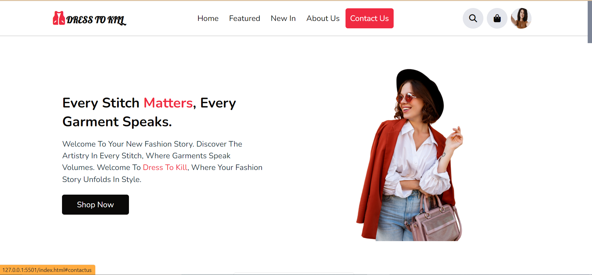
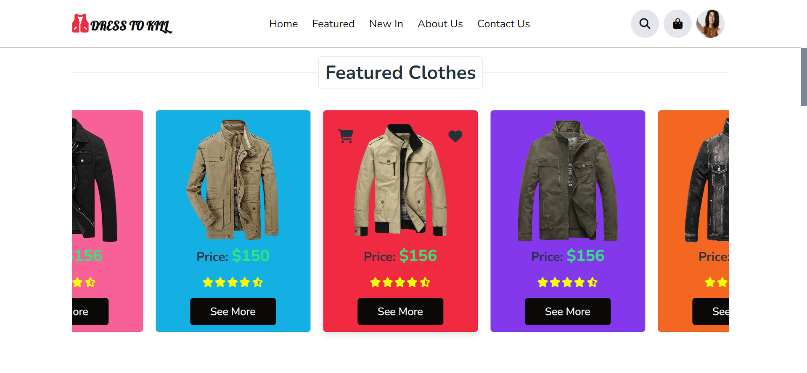
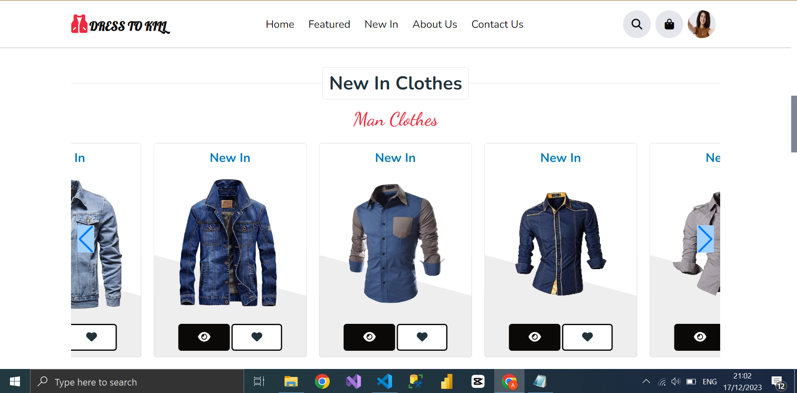
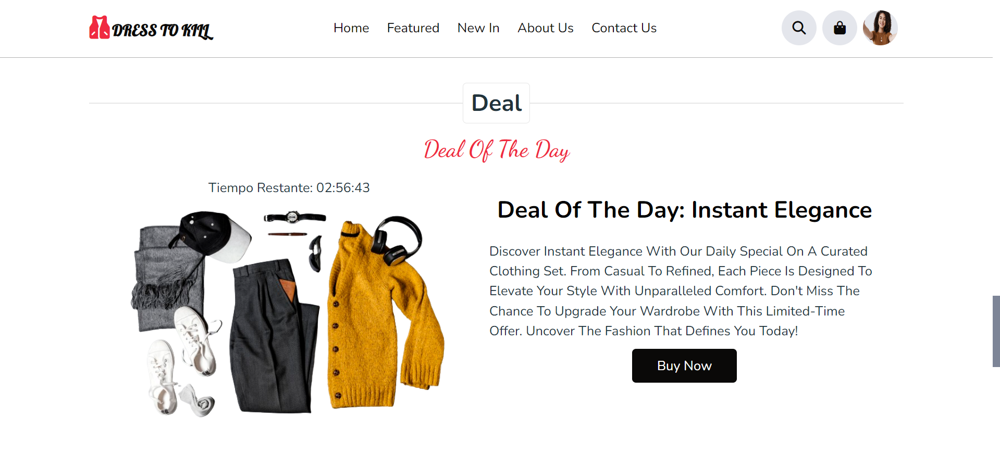

# Dress to Kill - Online Clothing Store

Welcome to Dress to Kill, a modern and stylish online clothing store.

## Installation

1. Clone this repository:

    ```bash
    git clone https://github.com/Jefrey13/Dress-to-kill.git
    cd dress-to-kill
    ```

2. Open `index.html` in your web browser.

## Project Structure

- 📁 **css**: General CSS style files.
- 📁 **css/section**: CSS style files for specific sections.
- 📁 **js**: JavaScript files.
- 📁 **image**: Images and visual resources.
- 📄 **index.html**: Main page of the store.

## Technologies Used

- HTML5
- CSS3
- JavaScript

## Features

- Explore a wide variety of fashionable clothing.

## Screenshots


*Screenshot of the Dress to Kill home page.*


*Screenshot of the Dress to Kill Featured page.*


*Screenshot of the Dress to Kill New In page.*


*Screenshot of the Dress to Kill Deal page.*

And more...

## Contributing

If you would like to contribute to our project, please follow these steps:

1. Fork the repository.
2. Create a new branch for your contribution.
3. Make your changes and submit a pull request.

We hope you enjoy your shopping experience at Dress to Kill!